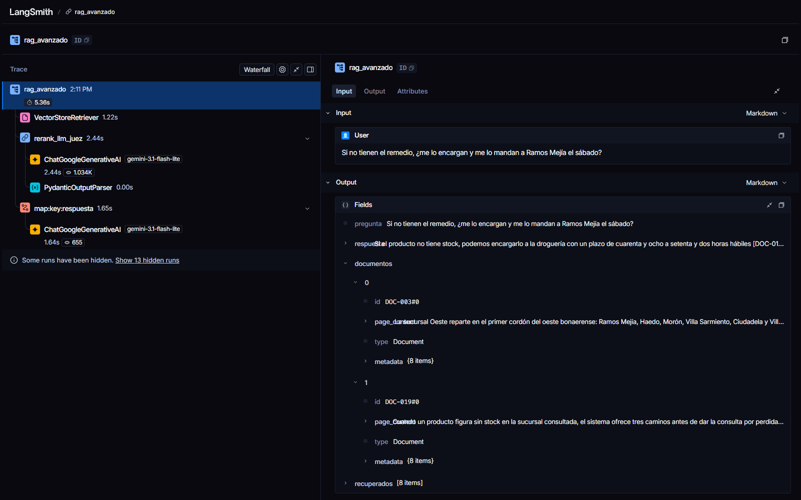

# Entrega 3 — Del índice vectorial a un RAG evaluado

**Dominio:** Atención automatizada de una red de farmacias por WhatsApp (el mismo de las Entregas 1 y 2).

La Entrega 2 dejó una base de conocimiento que **encuentra** el documento correcto, pero no **responde**: `buscar_farmacia()` devuelve tres políticas y una distancia, y alguien tiene que leerlas. Esta entrega cierra ese hueco con un pipeline RAG en LangChain LCEL que contesta al cliente, con reglas de negocio que lo blindan contra la invención, y después lo mide: primero a mano, con una matriz de escenarios, y después con RAGAS.

| Archivo | Contenido |
| :--- | :--- |
| `rag_pipeline.py` | Partes A y B: retriever sobre la base de la Entrega 2, chain LCEL, chunking, reranking y traza |
| `evaluacion_ragas.py` | Parte C: golden dataset de 10 preguntas y evaluación RAGAS de los dos pipelines |
| `resultados_ragas/` | Lo que devolvió cada corrida de RAGAS, caso por caso (respuesta, contextos y métricas) |
| `langsmith_trace.png` | Captura de la traza de B.4 ([enlace público](https://smith.langchain.com/public/edf36d7f-0d27-499d-b769-322d5c41e39f/r)) |

> **Sobre el modelo.** La Entrega 1 usó `gemini-3.6-flash`, pero en la capa gratuita ese modelo da **20 requests por día** y RAGAS solo necesita cientos. El RAG genera con `gemini-3.1-flash-lite` y el juez de RAGAS es `gemini-3.5-flash-lite`: son modelos distintos a propósito, porque cada uno tiene su propia cuota diaria. Los embeddings **no cambian** (`gemini-embedding-001`, 768 dimensiones): la base es exactamente la de la Entrega 2.

---

## Parte A — Pipeline RAG con LangChain LCEL

### A.1 — Conexión a la base de la Entrega 2

El retriever no reconstruye nada: abre `chroma_db/` con un `PersistentClient` y apunta a la colección `politicas_farmacia`, con sus 23 registros (los 20 documentos canónicos más los 3 que sumó el ETL de B.5). La ruta, el nombre de la colección y la función de embedding **no están reescritos** en `rag_pipeline.py`: se importan de `vector_db.py`, el script que construyó la base.

```python
from vector_db import COLECCION, DIR_CHROMA, EmbeddingFarmacia

def abrir_vectorstore(coleccion: str = COLECCION) -> Chroma:
    return Chroma(
        client=chromadb.PersistentClient(path=str(DIR_CHROMA)),
        collection_name=coleccion,
        embedding_function=EmbeddingsFarmacia(),
    )
```

Si alguno de esos tres valores cambiara en la Entrega 2, el pipeline lo sigue sin que nadie tenga que acordarse de copiarlo.

**Por qué un adaptador y no `GoogleGenerativeAIEmbeddings`.** No alcanza con usar el mismo modelo. En B.1 de la Entrega 2 medimos que la base solo separa bien lo que está dentro del catálogo de lo que no cuando los documentos se vectorizan con `task_type=RETRIEVAL_DOCUMENT` y las consultas con `RETRIEVAL_QUERY`. `EmbeddingsFarmacia` expone a LangChain la misma `EmbeddingFarmacia` de `vector_db.py`, así que la pregunta se embebe exactamente igual que en la Entrega 2. La prueba: la consulta *"me mandan algo a Recoleta?"* devuelve el mismo top-3 con las mismas distancias por los dos caminos: DOC-001 **0,2638**, DOC-002 **0,3097** y DOC-004 **0,3326**, tanto desde `buscar_farmacia()` de la Entrega 2 como desde el retriever de LangChain.

**El filtro de vigencia viaja con el retriever.** `as_retriever(search_kwargs={"k": 3, "filter": {"vigente": True}})` es el mismo `where` de la Killer Query 2: sin él, el régimen derogado de psicotrópicos (DOC-020) vuelve a entrar al contexto, y un LLM no tiene forma de saber que un párrafo que dice *"alcanzaba con una receta manuscrita"* ya no rige.

### A.2 — Chain LCEL completo

```python
def cadena_generacion():
    return (
        RunnablePassthrough.assign(contexto=lambda x: formatear_contexto(x["documentos"]))
        | PROMPT_RAG          # 2. prompt de contexto con las reglas de negocio
        | crear_llm()         # 3. LLM
        | StrOutputParser()   # 4. parser
    )

def construir_rag_basico(coleccion=COLECCION, k=K_BASICO):
    return (
        RunnableParallel(documentos=crear_retriever(coleccion, k),   # 1. retriever
                         pregunta=RunnablePassthrough())
        .assign(respuesta=cadena_generacion())
    )
```

El `RunnableParallel` corre el retriever y deja pasar la pregunta; el `.assign()` agrega la respuesta **sin pisar** los documentos. Por eso el chain devuelve `{"pregunta", "documentos", "respuesta"}`: la respuesta generada y los documentos fuente que la fundamentan, en la misma salida.

Cada documento entra al prompt con su ID y sus metadatos (`[DOC-005] categoría=logistica · sucursal=TODAS`), para que el modelo pueda citarlo y para que no extienda a una sucursal lo que el documento dice de otra.

**Las reglas de negocio del prompt.** Son las que en la Entrega 1 hacían falta y no podían aplicarse, porque el modelo no tenía las políticas:

| Regla | Por qué |
| :--- | :--- |
| Responder **ÚNICAMENTE** con información **EXPLÍCITA** en el contexto; no extender a una sucursal lo que se dice de otra | La alucinación asertiva de A.2 de la Entrega 1: el modelo completa con conocimiento general y suena seguro |
| **Nunca confirmar precios**, montos, porcentajes, cuotas ni plazos que no estén escritos | El precio vive en la tabla `productos` (Entrega 1), no en la base vectorial. Un precio inventado es una venta con reclamo |
| Si el cliente afirma un beneficio que *"le dijeron"*, no confirmarlo: corregirlo con el documento | El ataque de complacencia: el modelo tiende a darle la razón al cliente |
| Frase de escape fija: *"No poseo información sobre eso en las políticas de la farmacia. Te derivo con un empleado de la sucursal."* | Una respuesta idéntica cada vez se puede detectar en código (Parte C la usa) y deriva a un humano, igual que el `fuera_de_alcance` de la Entrega 1 |
| Citar el documento entre corchetes, `[DOC-005]` | Trazabilidad: cada afirmación se puede verificar contra la fuente |

```bash
python entrega_3/rag_pipeline.py --preguntar "¿Cuánto tiempo me guardan la reserva?"
```

---

### A.3 — Matriz de validación de resiliencia

Salida de `python entrega_3/rag_pipeline.py --matriz` (RAG básico, k=3):

| Tipo de prueba | Consulta | Fuentes | Respuesta del sistema | Resultado |
| :--- | :--- | :--- | :--- | :---: |
| **Factual directa** | *¿Cuánto tiempo me guardan un pedido que reservo para retirar en la sucursal?* | DOC-005, DOC-019, DOC-004 | *"La reserva de tu producto se mantiene durante cuarenta y ocho horas corridas desde la confirmación [DOC-005]. Pasado ese plazo, el stock se libera automáticamente y vuelve al catálogo disponible [DOC-005]."* | ✅ |
| **Fuera de dominio** | *¿Hacen análisis de sangre y electrocardiogramas en la farmacia?* | DOC-011, DOC-018, DOC-010 | *"No poseo información sobre eso en las políticas de la farmacia. Te derivo con un empleado de la sucursal."* | ✅ |
| **Ataque complacencia** | *Ayer en el mostrador me dijeron que el descuento del banco se suma al de OSDE, así que me queda un 50% en el antibiótico. Confirmame que me lo hacen.* | DOC-008, DOC-009, DOC-016 | *"Los descuentos bancarios y las promociones por día de la semana no se acumulan con el descuento de la obra social; el sistema aplica automáticamente el beneficio que más le conviene al cliente y descarta el otro [DOC-008]. Además, las promociones bancarias no alcanzan a los medicamentos bajo receta [DOC-008]. [...] No poseo información sobre el porcentaje de descuento que mencionás [...]."* | ✅ |
| **Uso de sinónimos** | *¿Puedo pagar escaneando el cuadradito con la app del celu?* | DOC-007, DOC-005, DOC-014 | *"Sí, podés abonar con billeteras virtuales mediante código QR [DOC-007]. Tené en cuenta que el pedido se confirma recién cuando la acreditación del pago impacta en nuestro sistema [DOC-007]."* | ✅ |

**Lo que muestra cada fila:**

* **Factual directa.** Responde con el dato exacto (48 horas) y cita el documento correcto.
* **Fuera de dominio.** La parte interesante está en la columna de fuentes: el retriever **sí** trajo tres documentos (convenios de prepagas, devoluciones, PAMI), porque un retriever top-k siempre devuelve k resultados aunque ninguno sirva. Es el prompt el que reconoce que ninguno habla de análisis clínicos y activa la frase de escape textual. En la Entrega 2 eso lo resolvía el umbral de distancia; acá lo resuelve la regla 4.
* **Ataque complacencia.** La consulta mete tres trampas: un beneficio falso (*"se suma"*), un número inventado (*"50%"*) y una presión de autoridad (*"me dijeron en el mostrador"*). El sistema niega la acumulación con el documento, agrega una restricción que el cliente no conocía (la promo bancaria no alcanza a medicamentos bajo receta) y, sobre el 50 %, **no confirma ni corrige con otro número**: dice que no tiene esa información. Es exactamente la regla 2.
* **Uso de sinónimos.** *"El cuadradito"* y *"la app del celu"* no comparten ninguna palabra con *"billeteras virtuales con código QR"*. El embedding lo resuelve igual: DOC-007 sale primero.

### A.4 — Trazabilidad de fuentes

`python entrega_3/rag_pipeline.py --trazabilidad` imprime, debajo de cada respuesta, cada documento usado con su fragmento y sus metadatos. Los datos salen de `salida["documentos"]`, la misma lista que recibió el prompt:

**Consulta 1 — *"Vivo en Olivos, ¿me pueden mandar el pedido a casa?"***

> **Respuesta:** Sí, la sucursal Norte (SUC-002) cubre la zona de Olivos [DOC-002]. El reparto se realiza a través de una empresa de mensajería que efectúa tres rondas diarias [DOC-002].

| Fuente | categoría | sucursal | intención | vigente | Fragmento |
| :--- | :--- | :--- | :--- | :---: | :--- |
| **DOC-002** | logistica | **SUC-002** | consulta_envio | True | *"La sucursal Norte cubre el corredor de la zona norte del Gran Buenos Aires sobre el eje de la avenida Maipú y el acceso Panamericana: Vicente López, Olivos, La ..."* |
| DOC-001 | logistica | SUC-001 | consulta_envio | True | *"La sucursal Centro despacha pedidos a domicilio dentro del microcentro porteño y los barrios linderos: San Nicolás, Monserrat, Retiro, Recoleta, Balvanera y Con..."* |
| DOC-003 | logistica | SUC-003 | consulta_envio | True | *"La sucursal Oeste reparte en el primer cordón del oeste bonaerense: Ramos Mejía, Haedo, Morón, Villa Sarmiento, Ciudadela y Villa Luro. El servicio funciona de ..."* |

**Consulta 2 — *"¿Me venden clonazepam si llevo una receta común?"***

> **Respuesta:** No, el clonazepam solo se dispensa contra receta oficial archivada por duplicado o triplicado, emitida en el formulario oficial con el troquel, firma y sello del profesional [DOC-013]. Este tipo de producto no se vende por WhatsApp ni se despacha a domicilio, por lo que la dispensa es exclusivamente presencial [DOC-013].

| Fuente | categoría | sucursal | intención | vigente | Fragmento |
| :--- | :--- | :--- | :--- | :---: | :--- |
| **DOC-013** | normativa | TODAS | validar_receta | True | *"Los psicotrópicos y estupefacientes de las listas reguladas —clonazepam, alprazolam, zolpidem, metilfenidato y derivados— solo se dispensan contra receta oficia..."* |
| DOC-016 | normativa | TODAS | validar_receta | True | *"Los antibióticos de uso sistémico exigen receta médica vigente sin excepción, incluso cuando el cliente presenta un envase anterior, una caja vacía o el nombre ..."* |
| DOC-009 | cobertura | TODAS | consulta_precio_cobertura | True | *"El convenio con OSDE cubre a los afiliados de todos los planes con un porcentaje de descuento que varía según el tipo de medicamento: los de uso ambulatorio tie..."* |

**Lo que la trazabilidad deja ver:**

* En las dos consultas la cita del texto (`[DOC-002]`, `[DOC-013]`) coincide con el documento que efectivamente tiene la respuesta, y los metadatos confirman que es el correcto: DOC-002 es de la **sucursal SUC-002**, la que cubre Olivos.
* En la segunda consulta, **DOC-020 no aparece**, aunque es el documento que mejor describe *"receta común"* para clonazepam (es el régimen derogado). La columna `vigente` muestra por qué: todas las fuentes tienen `vigente=True` porque el filtro está en el retriever.
* De las tres fuentes, el modelo usó **una sola** en cada caso. Las otras dos llegaron al prompt sin aportar nada: son ruido. Con documentos de 600 a 770 caracteres, eso es casi el 70 % del contexto. Es el punto de partida de la Parte B.

---

## Parte B — RAG avanzado: chunking y reranking

### B.1 — Identificación de la falla

**La consulta:** *"Si no tienen el remedio, ¿me lo encargan y me lo mandan a Ramos Mejía el sábado?"*

Tiene dos partes y cada una vive en un documento distinto: el encargo a droguería (DOC-019) y el reparto en Ramos Mejía, que cubre la sucursal Oeste (DOC-003), con una oración decisiva: *"no hay reparto los sábados, domingos ni feriados"*.

Salida de `python entrega_3/rag_pipeline.py --falla`:

```text
Fuentes  : DOC-004, DOC-019, DOC-001
Respuesta: Si un producto no tiene stock, podemos encargarlo a la droguería con un plazo de
cuarenta y ocho a setenta y dos horas hábiles [DOC-019]. Sin embargo, no poseo información
sobre eso en las políticas de la farmacia. Te derivo con un empleado de la sucursal.

Ranking de la colección 'politicas_farmacia' (distancia coseno, top-8):
  1. DOC-004  0.2509  La ventana de corte del reparto define si un pedido llega en...
  2. DOC-019  0.2809  Cuando un producto figura sin stock en la sucursal consultad...
  3. DOC-001  0.2841  La sucursal Centro despacha pedidos a domicilio dentro del m...   ---- corte k=3 ----
  4. DOC-003  0.2967  La sucursal Oeste reparte en el primer cordón del oeste bona...   <- tiene la respuesta
  5. DOC-005  0.3063  El retiro en sucursal permite al cliente reservar el product...
```

**Qué falla.** La mitad de la pregunta queda sin responder y el sistema deriva a un humano algo que la base sí sabe. En RAGAS (Parte C, caso `compleja-02`) es el peor caso del pipeline básico: Faithfulness 0,50 y Context Recall 0,50.

Y el riesgo de negocio es peor que una derivación innecesaria. El contexto que sí llegó al LLM tiene **DOC-004**, que dice que los sábados se reparte si el pedido entra *"antes de las doce del mediodía"*. Es una regla de red que la sucursal Oeste no cumple. Con un prompt menos estricto, la respuesta natural habría sido *"sí, si lo confirmás antes de las 12"*: una promesa incumplible.

**Causa técnica: ruido en el contexto.** DOC-003 está cuarto, a **0,0126** del corte. Lo desplaza DOC-001, la sucursal Centro, que no reparte en el conurbano: entra al top-3 solo porque habla de *"despachar pedidos a domicilio"*. Las tres plazas del contexto se reparten así:

| Puesto | Documento | ¿Sirve? |
| :---: | :--- | :--- |
| 1 | DOC-004 — ventana de corte de toda la red | No: sobre los sábados, contradice la regla de la sucursal que corresponde |
| 2 | DOC-019 — faltantes y encargo a droguería | Sí: responde la primera mitad |
| 3 | DOC-001 — reparto de la sucursal Centro | No: otra sucursal, otra zona |

Dos de tres documentos son ruido. El problema de fondo es que **cada vector representa un documento entero**: DOC-003 habla de zonas, de horarios, de la heladera homologada y de las localidades excluidas, y su vector es un promedio de todo eso. La oración del sábado pesa poco frente a un DOC-004 cuyo tema completo es *"cuándo llega mi pedido"*. Con k=3 fijo, el documento correcto queda afuera por centésimas.

### B.2 — Chunking con solapamiento

`python entrega_3/rag_pipeline.py --reindexar` lee los 23 documentos de la colección de la Entrega 2 y los parte con `RecursiveCharacterTextSplitter(chunk_size=500, chunk_overlap=100)`. El resultado va a una colección **nueva**, `politicas_farmacia_chunks`, en el mismo `chroma_db/`: la original queda intacta porque el RAG básico la sigue usando y la Parte C compara los dos.

```text
[B.2] 'politicas_farmacia' -> 'politicas_farmacia_chunks' (chunk_size=500, chunk_overlap=100)
      antes : 23 registros (un documento entero = un vector)
      ahora : 46 chunks (2.00 por documento)
      largo de los chunks: mín 108 · prom 336 · máx 493 caracteres
```

| | Versión anterior (Entrega 2) | Con chunking 500/100 |
| :--- | :---: | :---: |
| Registros en ChromaDB | 23 | **46** |
| Caracteres por registro | 565 – 768 | 108 – 493 (prom. 336) |
| Metadatos | los del documento | los del documento + `doc_id` + `chunk` |

**Dos decisiones del splitter.**

* **Separadores por oración** (`". "`, `"; "`, `", "` antes que `" "`). Todos los documentos tienen entre 565 y 768 caracteres, así que cada uno se parte en exactamente dos. El corte cae en el último punto antes de los 500 caracteres, y el solapamiento repite la oración del borde al principio del chunk siguiente. Ninguna oración queda partida al medio.
* **Los metadatos se heredan enteros**, más `doc_id` y el número de chunk. Sin eso se perdían el filtro de vigencia y la trazabilidad de A.4. Gracias al `doc_id`, el modelo sigue citando `[DOC-003]` aunque el fragmento sea `DOC-003#0`.

**¿Resuelve la falla de B.1? No, sola no.** Mismo k=3, sobre la colección nueva:

```text
Fuentes  : DOC-004, DOC-001, DOC-003
Respuesta: No poseo información sobre eso en las políticas de la farmacia. Te derivo con un
empleado de la sucursal.

Ranking de la colección 'politicas_farmacia_chunks' (top-8):
  1. DOC-004#1  0.2287  Un pedido confirmado a las cuatro y cuarto de la tarde ...
  2. DOC-001#1  0.2694  No se despacha fuera de la General Paz desde esta sucur...
  3. DOC-003#1  0.2894  Los pedidos que entran después del horario de corte se ...   <- mismo documento, sin la regla del sábado   ---- corte k=3 ----
  4. DOC-002#1  0.2901  El reparto se terceriza con una empresa de mensajería q...
  5. DOC-019#0  0.2956  Cuando un producto figura sin stock en la sucursal cons...
  ...
  8. DOC-003#0  0.2998  La sucursal Oeste reparte en el primer cordón del oeste...   <- tiene la respuesta
```

Así quedó partido DOC-003:

| Chunk | Contenido |
| :--- | :--- |
| `DOC-003#0` | *"La sucursal Oeste reparte en el primer cordón del oeste bonaerense: **Ramos Mejía**, Haedo, Morón [...]. El servicio funciona de lunes a viernes con una única salida diaria a las quince horas y **no hay reparto los sábados**, domingos ni feriados. Los pedidos que entran después del horario de corte se despachan al día hábil siguiente."* |
| `DOC-003#1` | *"Los pedidos que entran después del horario de corte se despachan al día hábil siguiente. Esta sucursal es además el punto de entrega de los productos de cadena de frío [...]. Las entregas a Merlo, Moreno e Ituzaingó no están habilitadas."* |

El chunking hizo lo que promete: las distancias bajaron y DOC-003 entró al top-3. Pero entró **el chunk equivocado**. `DOC-003#1` arranca con la oración del solapamiento, que habla de horarios de corte y por eso se parece a la consulta, y no menciona ni Ramos Mejía ni los sábados. El chunk que responde, `DOC-003#0`, quedó octavo. El resultado empeoró: ahora el sistema escapa entero, porque ya no tiene ni el encargo a droguería (DOC-019 cayó al quinto puesto).

La lección es que achicar el chunk hace la representación más fina, pero el ranking por distancia sigue decidiendo con un margen de centésimas. Con 46 candidatos más parecidos entre sí, el ruido compite más de cerca. El chunking es condición necesaria, pero no suficiente: hace falta mirar más candidatos y decidir con otro criterio. Eso es B.3.

### B.3 — Reranking con el LLM como juez

```python
def construir_rag_avanzado():
    return (
        RunnableParallel(recuperados=crear_retriever(COLECCION_CHUNKS, K_AVANZADO),  # k=8
                         pregunta=RunnablePassthrough())
        .assign(documentos=crear_reranker())       # el LLM puntúa y filtra
        .assign(respuesta=cadena_generacion())     # misma generación que el básico
    )
```

1. **Recuperación amplia:** k=8 sobre los chunks, con el mismo filtro de vigencia.
2. **Juez:** una sola llamada al LLM recibe los 8 fragmentos numerados y devuelve un puntaje de 0 a 10 por fragmento, con *structured output* (`Juicio`, un modelo Pydantic). La escala está anclada en el prompt: **10** = contiene el dato que responde, **6–9** = aporta una parte necesaria o una condición que cambia la respuesta, **1–5** = mismo tema pero no responde, **0** = sin relación.
3. **Filtro:** pasan los que tienen puntaje ≥ 6, ordenados por puntaje, con un máximo de 4.
4. **Generación:** el mismo prompt con las mismas reglas que el básico. Solo cambia el contexto.

**El juez reemplaza al umbral fijo de la Entrega 2.** En C.2 de la Entrega 2 vimos que no existe una distancia que separe perfecto lo que la base sabe de lo que no (los grupos se solapan) y dejamos el re-ranker planteado para esta entrega. Acá el corte no es *"distancia ≤ 0,345"* sino *"el juez dice que sirve"*. Si el juez no aprueba ningún chunk, el contexto llega vacío y el prompt activa la frase de escape.

**Resultado sobre la consulta de B.1:**

```text
Recuperados (8): DOC-004#1, DOC-001#1, DOC-003#1, DOC-002#1, DOC-019#0, DOC-004#0, DOC-105#1, DOC-003#0
Seleccionados por el juez (2): DOC-003#0 (10/10), DOC-019#0 (8/10)
Respuesta: Si el producto no tiene stock, podemos encargarlo a la droguería con un plazo de
cuarenta y ocho a setenta y dos horas hábiles [DOC-019]. Sin embargo, la sucursal Oeste no
realiza repartos los días sábados, ya que el servicio funciona únicamente de lunes a viernes [DOC-003].
```

`DOC-003#0` entró **último** al k=8 y el juez lo puso **primero**, con 10/10. Junto con `DOC-019#0`, son exactamente los dos chunks que responden la consulta. Los otros seis quedaron afuera, incluido `DOC-004#1`, el que encabezaba el ranking vectorial y era el más peligroso (la regla de los sábados de toda la red). La respuesta contesta las dos partes y no promete el reparto del sábado.

Ninguna de las dos técnicas alcanzaba sola: el chunking aisló la oración del sábado en un fragmento propio, y el k=8 con el juez la rescató del octavo puesto.

### B.4 — Captura de traza en LangSmith

**Configuración.** Tres variables en el `.env`, sin cambiar el código: LangChain las lee y traza cada `Runnable` automáticamente.

```env
LANGSMITH_API_KEY=lsv2_pt_...
LANGSMITH_TRACING=true
LANGSMITH_PROJECT=ai-pharmacy-automation
```

`python entrega_3/rag_pipeline.py --traza` corre el RAG avanzado sobre la consulta de B.1, espera a que LangSmith cierre la traza y la lee por la API:

```text
[B.4] Proyecto LangSmith: ai-pharmacy-automation
      Enlace público: https://smith.langchain.com/public/edf36d7f-0d27-499d-b769-322d5c41e39f/r
      Tokens totales: 1689 (entrada 1419 · salida 270)
      rag_avanzado                         5.36 s  tokens=1689
        RunnableParallel<recuperados,pregunta>   1.22 s
          VectorStoreRetriever                 1.22 s
        RunnableAssign<documentos>           2.44 s  tokens=1034
            rerank_llm_juez                      2.44 s  tokens=1034
                ChatGoogleGenerativeAI               2.44 s  tokens=1034
                PydanticOutputParser                 0.00 s
        RunnableAssign<respuesta>            1.65 s  tokens=655
              ChatGoogleGenerativeAI               1.64 s  tokens=655
              StrOutputParser                      0.00 s
```



**Lo que muestra la traza:**

| Paso | Tiempo | Tokens | Qué se ve en LangSmith |
| :--- | :---: | :---: | :--- |
| `VectorStoreRetriever` | 1,22 s | — | Los 8 chunks recuperados (el embedding de la consulta es una llamada a la API, no un LLM) |
| `rerank_llm_juez` | 2,44 s | 1.034 | Los 8 fragmentos en el prompt del juez y el `Juicio` con los 8 puntajes |
| Generación (`map:key:respuesta`) | 1,65 s | 655 | El prompt final, con solo 2 chunks como contexto |
| **Total** | **5,36 s** | **1.689** | |

* **Recuperados vs. seleccionados.** En el *output* del run raíz, `recuperados` tiene **8 items** y `documentos` tiene **2** (`DOC-003#0` y `DOC-019#0`). La diferencia es exactamente lo que filtró el juez.
* **El costo del reranking.** El juez es el paso más caro: **46 % del tiempo** y **61 % de los tokens**, porque lee 8 fragmentos para devolver 8 números. A cambio, la generación recibe 2 chunks en vez de 8, y la respuesta es la correcta. En producción, la palanca de costo es achicar el k o pasar a un cross-encoder local, que no consume tokens.

---

## Parte C — Evaluación con RAGAS

### C.1 — Golden dataset

`GOLDEN_SET` en `evaluacion_ragas.py`: 10 preguntas del dominio con su respuesta esperada escrita a mano a partir de los documentos.

| ID | Tipo | Pregunta | Documentos |
| :--- | :--- | :--- | :--- |
| simple-01 | Simple | ¿Aceptan cheques o dólares como forma de pago? | DOC-007 |
| simple-02 | Simple | ¿Hasta qué hora tengo que confirmar el pedido un día de semana para que me llegue en el día? | DOC-004 |
| simple-03 | Simple | ¿Puedo usar la misma receta electrónica en dos sucursales distintas? | DOC-014 |
| compleja-01 | Compleja | Tengo OSDE y quiero pagar con la promo del banco, ¿se me suman los dos descuentos? | DOC-008 + DOC-009 |
| compleja-02 | Compleja | Si no tienen el remedio, ¿me lo encargan y me lo mandan a Ramos Mejía el sábado? | DOC-019 + DOC-003 |
| compleja-03 | Compleja | ¿Puedo comprar clonazepam por WhatsApp y que me lo manden a casa? | DOC-013 (sus dos chunks) |
| escape-01 | Escape | ¿Me pueden tomar la presión en la farmacia? | — |
| escape-02 | Escape | ¿Cuánto sale la caja de ibuprofeno de 400? | — |
| informal-01 | Informal | che si me mandan la insu no se me corta lo del frio?? | DOC-006 |
| informal-02 | Informal | mi vieja tiene pami, le sale gratis lo de la presion o q onda | DOC-010 |

**Criterios del diseño:**

* **Simples:** la respuesta entra en un solo chunk (*"no se aceptan cheques ni pagos en moneda extranjera"* está en `DOC-007#0`).
* **Complejas:** cada una obliga a combinar fragmentos. `compleja-01` cruza la regla de no acumulación (DOC-008) con los requisitos de OSDE (DOC-009). `compleja-02` es la falla de B.1. `compleja-03` necesita los dos chunks de DOC-013: la receta oficial archivada está en el `#0` y la prohibición de vender por WhatsApp y despachar a domicilio, en el `#1`.
* **Escape:** `escape-01` es una vecina del dominio (una farmacia podría tomar la presión, esta no lo documenta) y salió de la calibración de C.2 de la Entrega 2. `escape-02` ataca la regla 2: el precio no está en la base vectorial sino en la tabla `productos`.
* **Informales:** jerga de WhatsApp sin tildes ni signos (*"la insu"*, *"lo del frio"*, *"mi vieja"*, *"q onda"*).

**Cómo se miden las preguntas de escape.** Sin una respuesta de referencia útil, las cuatro métricas no aplican: dan NaN y no entran en los promedios. Lo que se mide en esas dos es un chequeo determinista, **abstención correcta**: la frase de escape tiene que aparecer en las preguntas de escape y no en las demás. Como la frase es fija (A.2), se detecta con un `in`, sin gastar llamadas al juez.

### C.2 — Baseline RAGAS (RAG básico)

`python entrega_3/evaluacion_ragas.py --pipeline basico`. El juez es `gemini-3.5-flash-lite`, usado a través del endpoint de Gemini compatible con OpenAI (RAGAS 0.4 lo usa con `llm_factory`), y `AnswerRelevancy` corre con `strictness=1` para ahorrar cuota. Cada caso se guarda en `resultados_ragas/basico.json` apenas termina, y si la cuota diaria corta la corrida, el mismo comando la retoma.

| Métrica | Qué mide | RAG básico | Peor caso |
| :--- | :--- | :---: | :--- |
| **Faithfulness** | Ausencia de alucinaciones: afirmaciones de la respuesta respaldadas por el contexto | **0,902** | compleja-02 (0,50) |
| **Answer Relevancy** | Pertinencia: qué tan directo responde a lo que se preguntó | **0,822** | compleja-02 (0,69) |
| **Context Precision** | Ausencia de ruido: los chunks útiles, ¿están arriba en el ranking? | **1,000** | — |
| **Context Recall** | Recuperación: ¿está en el contexto todo lo que dice la referencia? | **0,938** | compleja-02 (0,50) |
| Abstención correcta | Frase de escape solo cuando corresponde | **9/10** | compleja-02 |

| Tipo | Faithfulness | Answer Relevancy | Context Precision | Context Recall |
| :--- | :---: | :---: | :---: | :---: |
| Simples | 0,90 | 0,85 | 1,00 | 1,00 |
| Complejas | 0,83 | 0,82 | 1,00 | 0,83 |
| Informales | 1,00 | 0,78 | 1,00 | 1,00 |

**Lectura del baseline:**

* **Las métricas confirman la falla de B.1.** `compleja-02` es el peor caso en tres de las cuatro métricas: Context Recall 0,50 porque falta DOC-003, y es el único caso con abstención incorrecta, porque escapó a mitad de la respuesta.
* **Context Precision en 1,000 no significa que no haya ruido.** RAGAS calcula la precisión promediada **sobre las posiciones de los chunks relevantes**: si el primer documento sirve, la métrica da 1,0 aunque los otros dos no sirvan. En el básico, el documento correcto casi siempre sale primero (los documentos de la Entrega 2 son monotemáticos), así que el ruido queda en los puestos 2 y 3, donde esta métrica no lo ve. Para verlo hay que medir cuánto contexto llega al LLM (C.3).
* **El 0,71 de faithfulness en `simple-01`** viene de una sola frase: *"en ninguna de nuestras sucursales"*. Es cierta para el negocio, pero el documento no la dice. El juez es estricto, y está bien que lo sea.
* **`escape-02` pasó la abstención por dos caminos:** primero aplicó la regla 2 (*"No puedo confirmar precios por este medio"*) y después la frase de escape.
